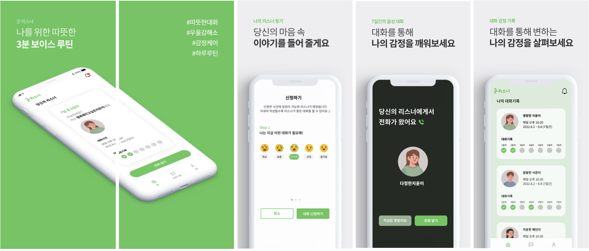
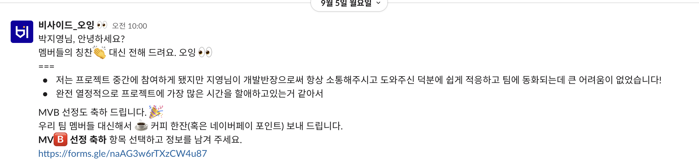

# 소개

리스너(관리자)와 스피커(사용자) 가 매일 저녁 3분씩 `오늘 하루 어땠나요?`라는 주제로 `대화`를 나누는 마음 건강 지키미 앱입니다.   (기간: 2022. 06 - 11.(지금은 서버 끊긴 상태))) 

 

# 개발 환경
- 화면 구성: UIkit
- 디자인 패턴: MVVM, Clean Architecture, Coordinator
- 의존성 관리 도구: CocoaPods, Swift Package Manager
- 배포: Fastlane
- 네트워킹: Moya
- 비동기프로그래밍: Rxswift, RxCocoa, DispatchQueue(매칭 화면 전환)
- 기타 라이브러리: AgoraRtcKit, Firebase Messaging

 

# 상세 화면

 

# 역할

(개발 4명 + 기획 2명 + 디자인 2명 참여)

- 개발 반장으로서의 역할: 매주 회의를 통해 이슈 조정, 기획/디자인 파트와 의견 조율
- iOS 개발자로서의 역할: 리스너와 스피커의 홈/대화 기록/매칭 대기 화면/알림 화면에서의 UI 구성 및 API 호출, FastLane을 통한 CD

 

# 문제와 해결책

- 프로젝트 초반 `상세 기획`이 나오지 않아 어려움

  - 기획안이 화면 위주의 구성이다보니 기획자님께서 생각하셨던 기획안과 개발이나 디자인에서 생각했던 상세 기획안이 모두 제각기 달랐습니다. 전체 회의를 통해 기획자님께 상세기획안 요청 드려 문제를 해결하였습니다.

- 개발자로서의 역할과 개발 반장으로서의 `역할 상충`

  - 앱 배포시 백엔드 데이터 준비가 안되어 프론트에서는 이미 완성 되었음에도 불구하고 모두 주석 처리하고 심사 올렸습니다.

- Fastlane을 도입해 앱 배포 시간을 30분에서 `10분으로 단축`

  - 매주 팀원들을 위해 앱을 업로드해야 하는데 매번 올릴 때마다 30-40분 이상 오랜 시간이 걸려 불편하다는 단점이 있었습니다. 이를 개선하기 단축하기 위해 fastlane 도입함으로써 앱 업로드 시간을 단축하였습니다.

- collectionView에서 사용자가 cell을 재클릭 시 selected 해제되야 하는 문제 

  - didDeselectItemAt와 enumerated 를 활용해 해결하였습니다.
 

 

# 소감

### `A - Z`

아이디어 브레인 스토밍부터 MVP 줄여 나가기, 개발, 배포까지 모두 개발자, 기획자, 디자이너님들과 함께 할 수 있었던 뜻깊은 시간이었습니다.

### `소통`

개발자는 개발 잘하는 것도 중요하지만 소통 잘하는 것 또한 그에 못지 않게 중요하다는 사실을 절실히 느낀 프로젝트였습니다. 
<b>'개발 반장'</b>이란 역할을 처음 맡아 보니 개발자, 기획자, 디자이너가 생각하는 `좋은 개발자`의 정의는 제각기 모두 달랐습니다. `개발자`에게는 <b>'개발 잘하는 개발자' </b>가, `기획자`에게는 <b>'기획에도 함께 참여하는 개발자'</b> 가, `디자이너`에게는 <b>'내가 디자인 한 디자인의 그 의도를 파악해 잘 구현해 주는 개발자'</b>가 '좋은 개발자' 일 것입니다. 조금씩은 다른 이해 관계 속에서 `하나의 완제품`이 완성되기 위해서는 중간에서 서로의 `의견을 조율`하고 `대화`를 통해 갈등을 해결해나가는 과정이 무엇보다 중요하다는 생각을 하게 되었습니다.

### `함께`

github PR 을 통해 같은 iOS 개발자님과 함께 `코드 리뷰`를 진행하였습니다. 코드 리뷰를 위해 클린한 코드를 작성하기 위해 노력할 수 있었고, 리뷰를 통해 저의 코드가 한층 더 성장할 수 있었던 소중한 시간이었습니다. 혹시 미처 동료가 생각하지 못했던 경우의 수가 있다면 리뷰를 통해 함께 개선해 나가려고 노력했습니다. 리뷰를 달기 전에는 저의 입장이 아닌 타인의 입장에서 어떤 식으로 제가 전달하고자 하는 메시지를 효과적으로 전달할 수 있을 지 고민해 볼 수 있었습니다. 

### `팀원들로부터 받은 평가`

